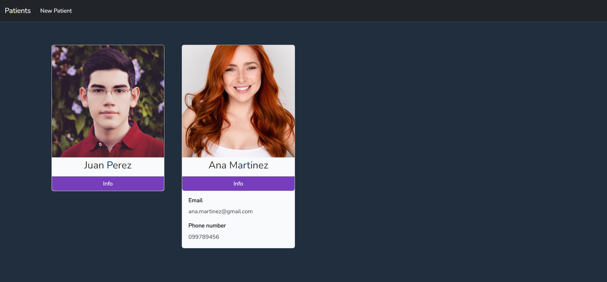

# FullStack - New Challenge
https://lightit.slite.page/p/lzAFJyBVgxbWAO/FullStack-New-Challenge

Patient registration aplication.
 
# Container Installation Instructions

To set up and run this container, please follow the steps below:

Please note that the **default database password**git is 'root'.

1. Clone this repository to your local machine.

2. Navigate to the repository directory using your terminal, until you reach the PatientApi folder.

3. Configure the .env file
    ```shell

    echo APP_NAME=Laravel > .env
    echo APP_ENV=local >> .env
    echo APP_KEY=base64:ufEelcr60a/ZJ4TYxo+MYbkZc2Mmk4cf/z+KXJSJMbU= >> .env
    echo APP_DEBUG=true >> .env
    echo APP_URL=http://localhost >> .env
 
    echo LOG_CHANNEL=stack >> .env
    echo LOG_DEPRECATIONS_CHANNEL=null >> .env
    echo LOG_LEVEL=debug >> .env
 
    echo DB_CONNECTION=mysql > .env
    echo DB_HOST=mysql >> .env
    echo DB_PORT=3306 >> .env
    echo DB_DATABASE=patientapi >> .env
    echo DB_USERNAME=root >> .env
    echo DB_PASSWORD=root >> .env

    echo BROADCAST_DRIVER=log >> .env
    echo CACHE_DRIVER=file >> .env
    echo FILESYSTEM_DISK=local >> .env
    echo QUEUE_CONNECTION=database >> .env
    echo SESSION_DRIVER=file >> .env
    echo SESSION_LIFETIME=120 >> .env
 
    echo MEMCACHED_HOST=127.0.0.1 >> .env

    echo REDIS_HOST=127.0.0.1 >> .env
    echo REDIS_PASSWORD=null >> .env
    echo REDIS_PORT=6379 >> .env
 
    echo MAIL_MAILER=smtp >> .env
    echo MAIL_HOST=smtp.gmail.com >> .env
    echo MAIL_PORT=587 >> .env
    echo MAIL_USERNAME=mail_address >> .env
    echo MAIL_PASSWORD=mail_password_for_applications >> .env
    echo MAIL_ENCRYPTION=tls >> .env
    echo MAIL_FROM_ADDRESS=mail_address >> .env
    echo MAIL_FROM_NAME="${APP_NAME}" >> .env

    echo AWS_ACCESS_KEY_ID= >> .env
    echo AWS_SECRET_ACCESS_KEY= >> .env
    echo AWS_DEFAULT_REGION=us-east-1 >> .env
    echo AWS_BUCKET= >> .env
    echo AWS_USE_PATH_STYLE_ENDPOINT=false >> .env

    echo PUSHER_APP_ID= >> .env
    echo PUSHER_APP_KEY= >> .env
    echo PUSHER_APP_SECRET= >> .env
    echo PUSHER_HOST= >> .env
    echo PUSHER_PORT=443 >> .env
    echo PUSHER_SCHEME=https >> .env
    echo PUSHER_APP_CLUSTER=mt1 >> .env

    echo VITE_APP_NAME="${APP_NAME}" >> .env
    echo VITE_PUSHER_APP_KEY="${PUSHER_APP_KEY}" >> .env
    echo VITE_PUSHER_HOST="${PUSHER_HOST}" >> .env
    echo VITE_PUSHER_PORT="${PUSHER_PORT}" >> .env
    echo VITE_PUSHER_SCHEME="${PUSHER_SCHEME}" >> .env
    echo VITE_PUSHER_APP_CLUSTER="${PUSHER_APP_CLUSTER}" >> .env

4. Build and start the containers in detached mode using Docker Compose:
   
   ```shell
   docker compose up -d
5. Build the database patientapi:
  (If you have any errors, wait a few seconds and try this point again.)
    ```shell
   docker exec -it mysql mysql -uroot -p -e "CREATE DATABASE IF NOT EXISTS patientapi;"
6. Run migrations:
    ```shell
    docker exec -it patientapi-web-1 php artisan migrate
7. Create a symbolic link for storage using the following command:
    ```shell
    docker exec -it patientapi-web-1 php artisan storage:link
    
Now your container is set up and ready to use.

To access the web application, open your web browser and enter the following URL:
http://localhost:9000



<video src="04-10-2023_04-21-18.mp4" controls title="Title"></video>